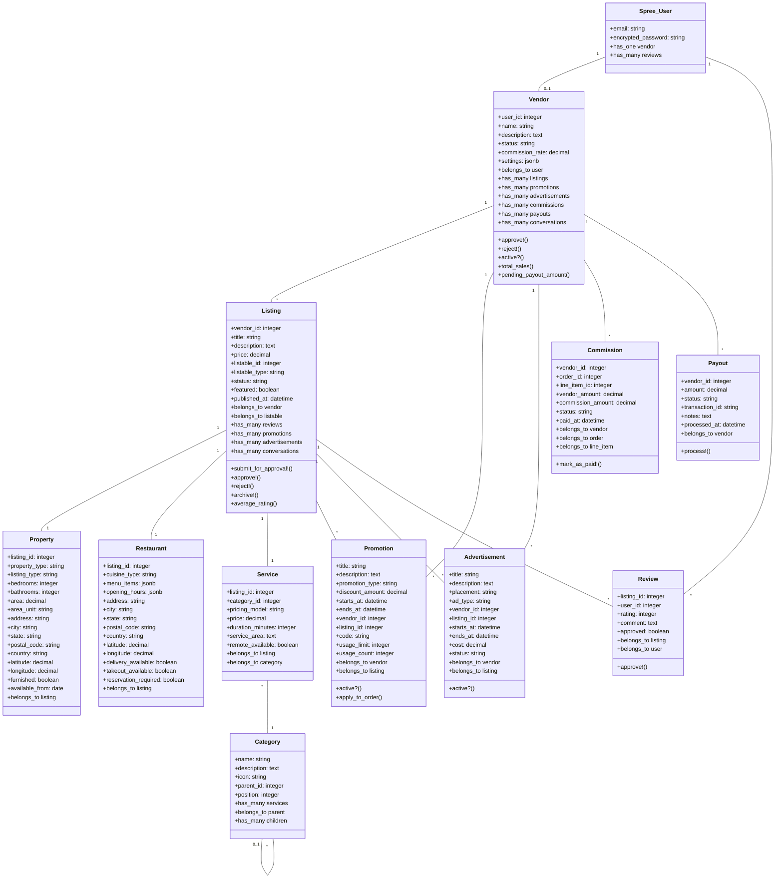

# Komplex UML Class Diagram

This UML class diagram illustrates the relationships between the core models in the Komplex module. The diagram shows the attributes and methods of each class, as well as the associations between them.

## Key Relationships

- A **Spree::User** can have one **Vendor** account
- A **Vendor** can have many **Listings**, **Promotions**, **Advertisements**, **Commissions**, and **Payouts**
- A **Listing** belongs to a **Vendor** and can be one of several types (Property, Restaurant, Service) through a polymorphic association
- **Promotions** and **Advertisements** can be associated with a specific **Vendor** and optionally a specific **Listing**
- **Reviews** are associated with a **Listing** and the **Spree::User** who created them
- **Commissions** track the financial transactions between the platform and **Vendors**
- **Payouts** represent money transferred to **Vendors**

This structure provides a flexible foundation for a multi-vendor marketplace with support for various listing types and marketing features.